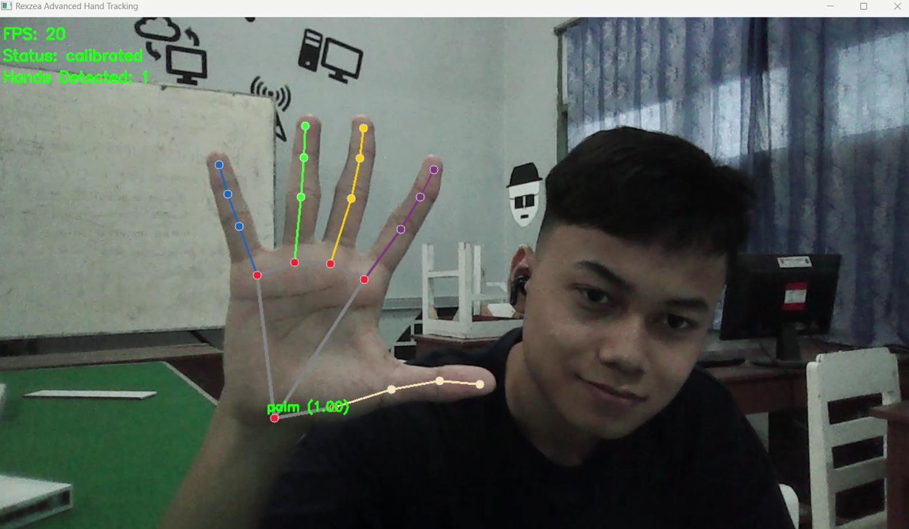

#  Hand Tracking - Interactive Gesture Recognition


<div align="center">

<video width="100%" controls>
  <source src="assets/subwaytrim.mp4" type="video/mp4">
</video>




```
🌟 Hand Gesture Recognition 🌟
Real time hand tracking powered by Computer Vision and Machine Learning
```
</div>

## 🎯 Overview
This project implements a realtime hand tracking system that can detect and interpret hand gestures using computer vision technology. Perfect for interactive applications, gaming, and gesture controlled interfaces.

## ✨ Key Features
- 🔍 **Hand Detection**
  - Real time hand tracking with frame by frame analysis
  - Multi hand support
  - Robust tracking in various lighting conditions
  
- 🖐️ **Gesture Recognition**
  - Accurate finger counting system
  - Dynamic gesture interpretation
  - Machine Learning recognition algorithm
  
- 🎮 **Interactive Mini Game**
  - Gesture-based scoring system
  - ✊ Fist gesture = +10 points
  - 🔄 Dynamic combo system for higher scores
  - Real-time score tracking

## 🚀 Technology Stack
```
Core Technologies:
📌 MediaPipe - ML pipeline for hand tracking
📌 OpenCV - Computer vision framework
📌 NumPy - Mathematical computations
📌 PyGame - Robust game development framework
```

## ⚡ Installation & Setup

### Prerequisites
- Python 3.7 or higher
- Webcam or camera device
- Minimum 4GB RAM recommended
- Internet connection for initial setup

### Setup Instructions
```bash
# Clone the repository
git clone https://github.com/rexzea/Simple-Hand-Tracking.git

# Navigate to project directory
cd Simple-Hand-Tracking

# Create and activate virtual environment (recommended)
python -m venv venv
source venv/bin/activate  # On Windows: venv\Scripts\activate

# Install dependencies
pip install -r requirements.txt
```

### 🎮 Running the Application
Choose your preferred method:

1. 🟢 **IDE Method**
   - Open the project in your favorite Python IDE
   - Click the run button (▶️)

2. 🟡 **GUI Method**
   - Navigate to the project folder
   - Right click on the main Python file
   - Select "Run with Python"

3. 🔵 **Command Line Method**
   ```bash
   python main.py
   ```

## 🛠️ Troubleshooting Guide
Common issues and solutions:

- 🔧 **Module Import Errors**
  - Solution 1: Install using Anaconda environment
  - Solution 2: Check Python version compatibility
  - Solution 3: Reinstall dependencies

- 📷 **Camera Issues**
  - Solution 1: Verify camera connections
  - Solution 2: Check camera permissions
  - Solution 3: Try alternative camera input

- 🖥️ **Performance Optimization**
  - Recommended: Close unnecessary background applications
  - Ensure adequate system resources
  - Consider reducing frame resolution if needed

## 🤝 Contributing
We welcome contributions! Here's how you can help:

```
🌟 Join Our Development Community!
- 🐛 Report bugs and issues
- 💡 Propose new features
- 🔧 Submit pull requests
- 📚 Improve documentation
```

### Contribution Guidelines
1. Fork the repository
2. Create your feature branch (`git checkout -b feature/NewFeature`)
3. Commit your changes (`git commit -m 'Add some NewFeature'`)
4. Push to the branch (`git push origin feature/NewFeature`)
5. Open a Pull Request

## 📞 Support & Contact
Need assistance? Reach out through:
- 📧 Email: [futzfary@gmail.com](mailto:futzfary@gmail.com)
- 📱 Phone: +62 898-8610-455
- 💬 GitHub Issues: Open a new issue in the repository

<div align="center">


```
🌟 Crafted with ❤️ by Rexzea 🌟
```
</div>

---

<div align="center">

### Show Your Support
⭐ Star this repository if you find it helpful! ⭐

[Report Bug](https://github.com/rexzea/Simple-Hand-Tracking/issues) · [Request Feature](https://github.com/rexzea/Simple-Hand-Tracking/issues)
</div>
