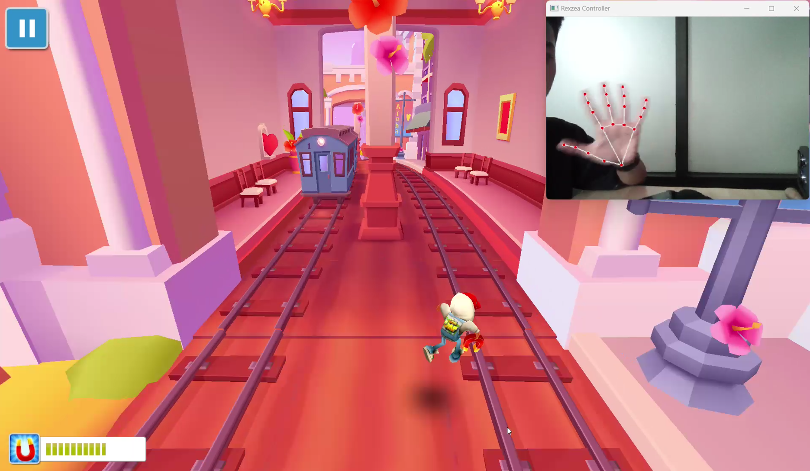

#  Hand Tracking - Interactive Gesture Recognition

Transform your gaming experience with hand gesture controls! Play Subway Surfers using natural hand movements, powered by advanced computer vision technology.

 [Report Bug](https://github.com/rexzea/Simple-Hand-Tracking/issues) • [Request Feature](https://github.com/rexzea/Simple-Hand-Tracking/pulls)

